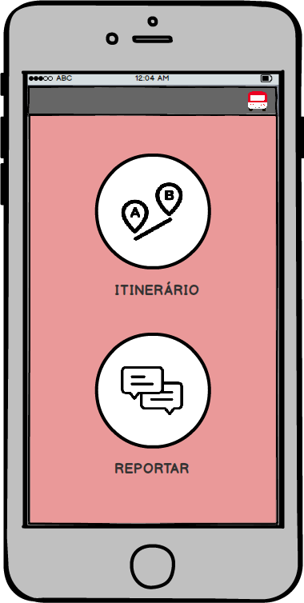

# JustGo


OVERVIEW
--------------------------------------------------
This is an UX-Design project of a mobile app called Just Go for the [Human Computer Interaction] course. The purpose of this project was to study Gestalt principles through a design of a mobile application.  It was made at the Computer Science undergraduate program from University of São Paulo (ICMC - USP).

The purpose of the app is to make people's lives easier when they need to catch a bus.
Similarly to other apps, with JustGo the user has two main roles:

```bash
  * Search for information.
  * Feed the app with information.
```

FUNCTIONAL REQUIREMENTS
--------------------------------------------------
 * Check-in.
 * To check the best routes from one point to another in the city through public transportation.
 * To check bus routes in a city to obtain an approximate time of arrival of the vehicle at a particular stop.
 * Check and notify if a bus is crowded.
 * Check statistics and notify delay in bus lines.
 * Report problems related to a particular bus.
 * Provide location data for certain bus lines.

SPACE DESIGN
--------------------------------------------------
Requirements to implement: Calculating the best route considering prices and time, saving route data and to check-in.
Counterparts to consider: Road accidents, weather influences such as rain, user with invalid data and/or unavailable cash.

INTERFACE
--------------------------------------------------
The following interface was an attempt to use familiarity concepts which is part of the `Learnability` usability principle. The idea of familiarity was applied in relation to the icons and figures of the application because they refer to everyday situations and other applications such as Google Maps. Gestalt principles were also used as `proximity`, `similarity` and `figure-ground`. Regarding the red color of the interface, it was chosen based on the logo of the application but with little brightness referring to the flat design.

SCENARIO
--------------------------------------------------
A person is in a remote neighborhood in a city and does not know where to take the bus to go back to his/her home, so he/she opens the JustGo application and then clicks on the itinerary option, indicating the current position by pressing the pin icon in the source and filling the destination with the home adress. A map will appear indicating where you are and which bus lines are closest to you. The person observes which line is the least crowded and has the least time for the arrival of his bus and clicks on it, then details will be shown related to that line and the directions to reach your destination.

ERROR SITUATION (USER)
--------------------------------------------------
In the itinerary screen, if the user enters the destination instead of source, the system has an arrow icon in both directions to perform the exchange.

INTERFACE DESIGN
--------------------------------------------------





MORE INFO
--------------------------------------------------

* What are Gestalt Principles? <https://en.wikipedia.org/wiki/Principles_of_grouping>
